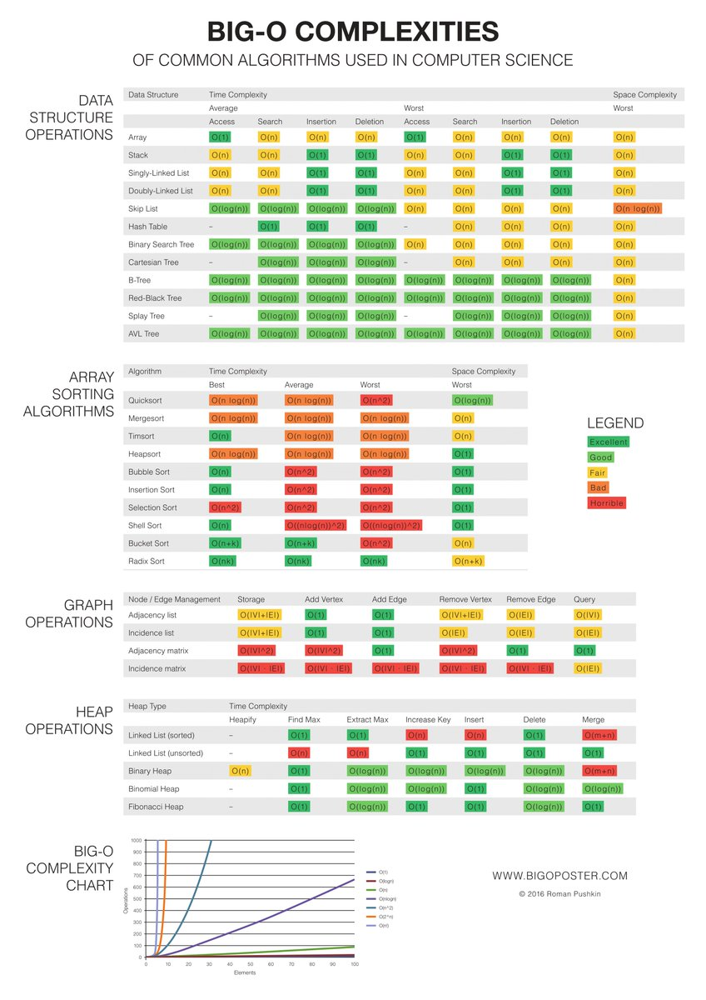

[return to overview](/interview)

[return to concepts](materials)

## Time Complexity
Time complexity, oftentimes referred to as _Big-O_, is a measure of the amount of a time an algorithm takes to run given _n_
amount of input. It can be used to determine how well algorithms scale given the size of the input data.

## Real World Example
Suppose you want to watch 3 movies this weekend. You have two ways of going about obtaining them:
1. Downloading them from a (legal) service.
2. Ordering DVDs online.

The former is certainly the most convenient, but consider the size of movies these days. On a slow connection, it could
take ages to download your movies! The more films you want to watch, the longer you have to wait for them to download.

If you were to order physical copies of the movies, you have to wait a couple of days for the package to arrive. The contents of the package
don't affect the shipping time; you could order 1 or 100 movies and it'd still take a couple of days.

Now think of the two methods as algorithms. The first one has a time complexity of __O(n)__ because the wait time is proportional
to the number of movies you want to watch (__n__). The second method has a time complexity of __O(1)__, otherwise known as constant time
because no matter how many movies you order, the wait time is the same. 

When _n=3_, the latter is the best choice in this context. It's up to the programmer to detemrine which algorithm is best for their needs depending
on the size of the data and the problem at hand.

<!-- TODO: fix these links -->
## Big-O Cheat Sheet

---
[return to overview](/interview)

[return to concepts](materials)
